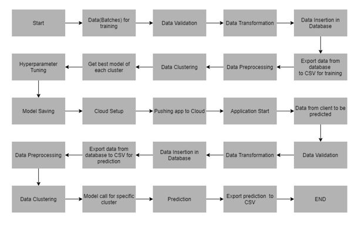
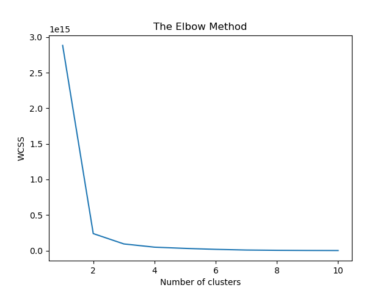

# Insurance Claim Fraud Detection

### Problem Statement

To build a classification methodology to determine whether a customer is placing a fraudulent insurance claim.

### Architecture

The Csv file(s) from the data batches path is read, the validation,transformation steps are performed and the cleaned data is exported from a sqlite database to a csv file, and this csv file serves as the training data for the ML models.

Clustering: KMeans algorithm is used to create clusters in the preprocessed data and the optimum number of clusters is selected by plotting the elbow plot. The idea behind clustering is to implement different algorithms for each cluster.

After the clusters have been created, we find the best model for each cluster by using two algorithms, “SVM” and "XGBoost". For each cluster, both the algorithms are passed with the best parameters derived from GridSearch and the models for each cluster are saved for prediction.

The prediction csv file is created at the path _fraudDetection/Prediction_Output_File/Predictions.csv_

### Deployment 🚀

A frontend application is developed using the flask framework and deployed to Heroku cloud platform.

## App URL:

https://app-frauddetection.herokuapp.com/

---

### Links 🔗

